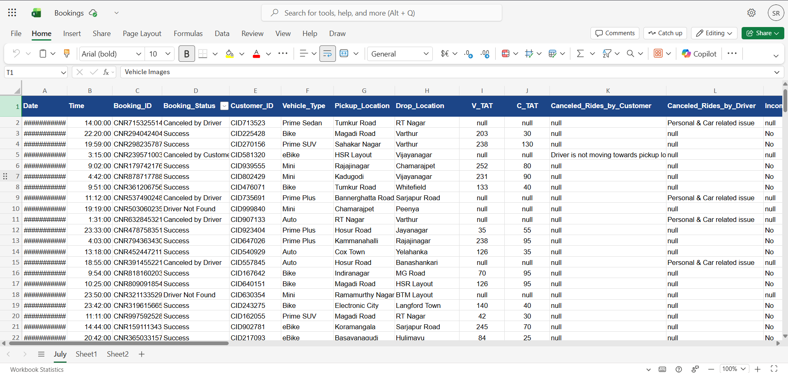
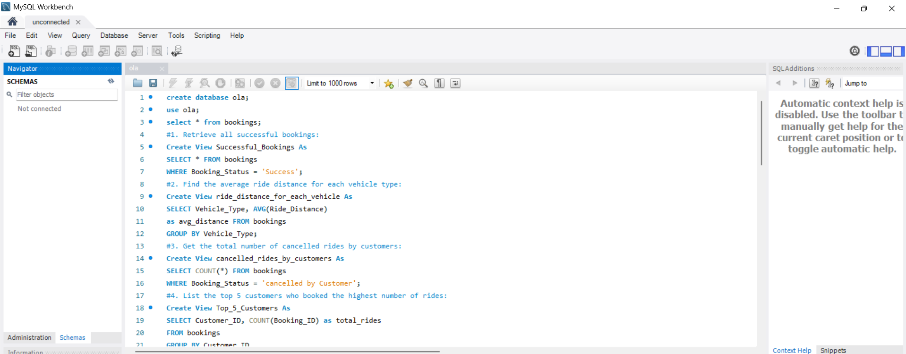
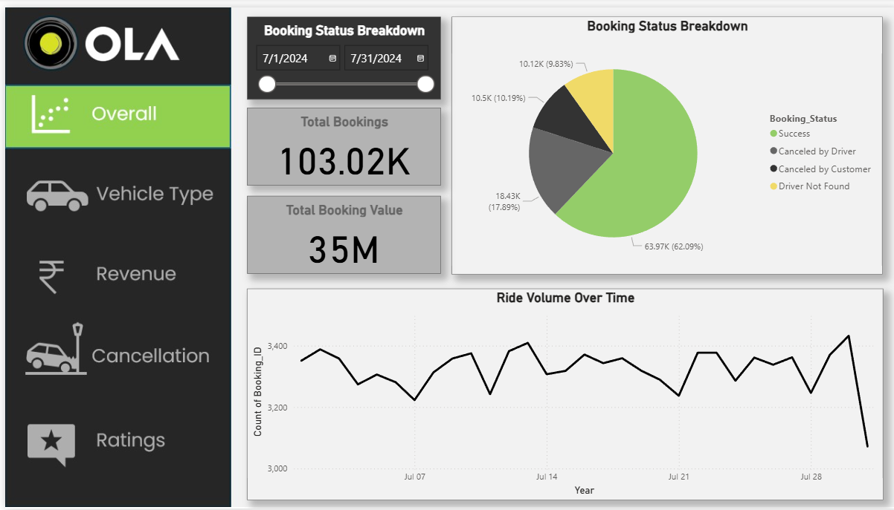

# OLA Bengaluru Operations: ₹5-7M Revenue Opportunity

**Excel + SQL + Power BI | 100K rides analyzed | 62%→70% success rate | ₹5-7M revenue opportunity**

## 🎯 Key Findings

| Metric | Current | Target | Impact |
|--------|---------|--------|--------|
| Success Rate | 62% | 70% | ₹4.1M/year |
| Revenue | ₹31.5M/mo | ₹37-38.5M | **₹5-7M/year** |
| Rating | 4.1/5 | 4.4/5 | 15% retention |

## 📊 Dataset (Excel)
**100K records, 19 columns**

## 🔍 SQL Analysis (10 Queries)

## 📈 Power BI Dashboard
**5 Interactive Views**

## 💰 Business Impact

| Problem | Loss | Solution | ROI |
|---------|------|----------|-----|
| Low Success Rate | ₹7.5M | All fixes | 10x |
| Driver Cancellations | ₹9.3M | Real-time tracking | 8-10x |
| Low Value | ₹5.2M | Dynamic pricing | 12-15x |

## 🛠️ Tech Stack
**Excel → SQL → Power BI**

**Portfolio by Sanyogita Rajput** | LinkedIn: [your-link]

⭐ Star if helpful!

